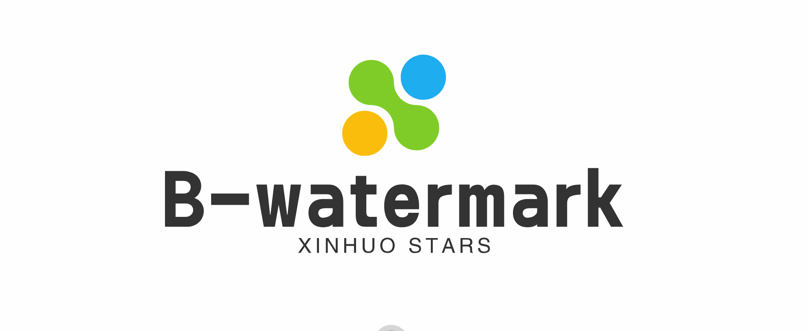
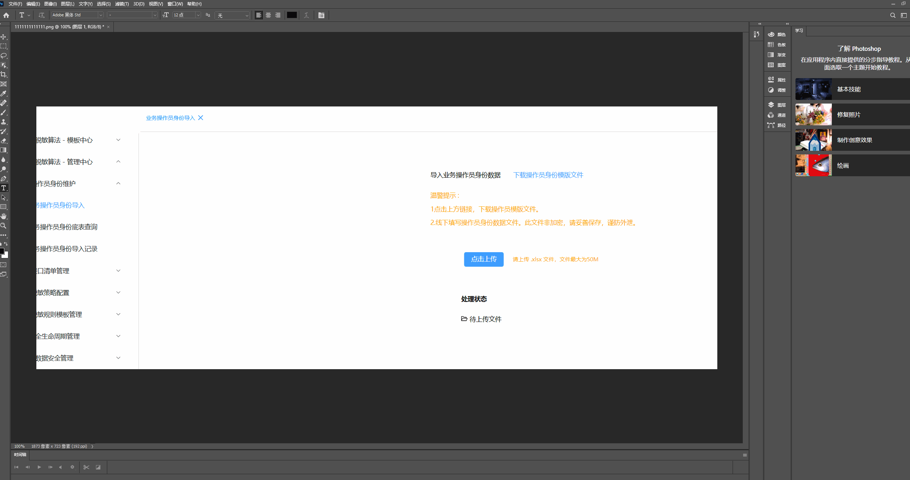
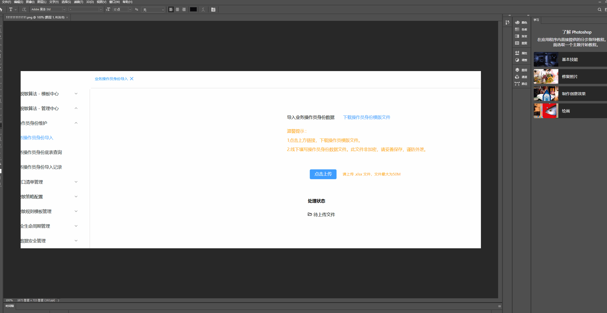
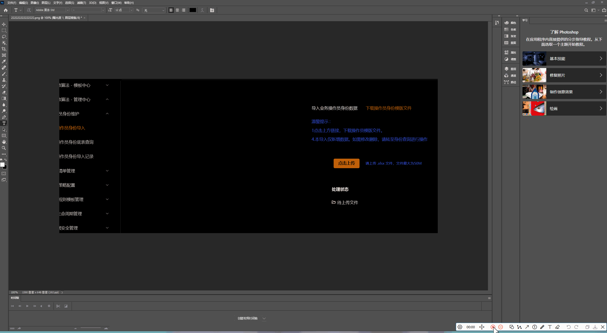

<p align="center">
  <a target="_blank" href="https://github.com/Huo-zai-feng-lang-li/vue3-blind-watermark">
  
  </a>
</p>

<p align="center">
  <h3 align="center">vue3-blind-watermark</h3>
  <p align="center" style="font-size:14px">路虽远行则将至，事虽难做则必成！</p>
</p>

简体中文 | [English](./readme.en.md)

## vue3-blind-watermark

- 迄今为止 **_最易用_** 的盲水印实现方案
- 这个插件的作用是在页面上添加一个可自动调整颜色以适应不同背景的 **不可见水印**，同时通过观察 DOM 变化来保证水印的持续存在（防篡改）。

### 安装

```js
npm install vue3-blind-watermark
```

### 引入&使用

- 在你的主应用程序入口文件（例如 main.js）中，导入并使用 watermark ：

```js
import watermark from "vue3-blind-watermark";
app
	.use(watermark, {
		text: "版权归xxx所有",
	})
	.mount("#app");
```

### 盲水印测试

<p align="center">
  <a target="_blank" href="https://github.com/Huo-zai-feng-lang-li/vue3-blind-watermark">
  
  </a>
</p>

<p align="center">
  <a target="_blank" href="https://github.com/Huo-zai-feng-lang-li/vue3-blind-watermark">
  
  </a>
</p>

<p align="center">
  <a target="_blank" href="https://github.com/Huo-zai-feng-lang-li/vue3-blind-watermark">
  
  </a>
</p>

### 贡献

> 如果你有任何改进的建议或想要贡献代码，请随时创建 pull 请求或提交问题。
