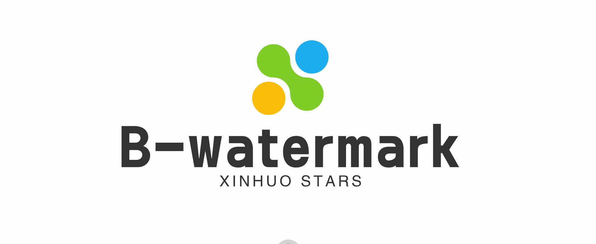
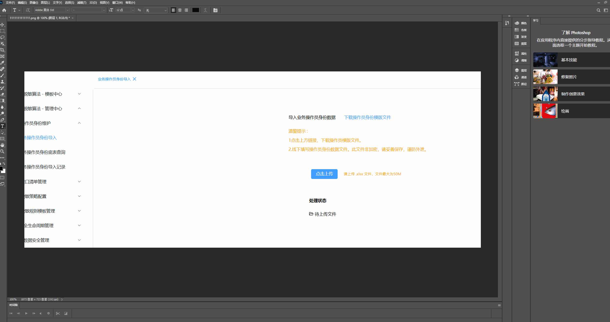
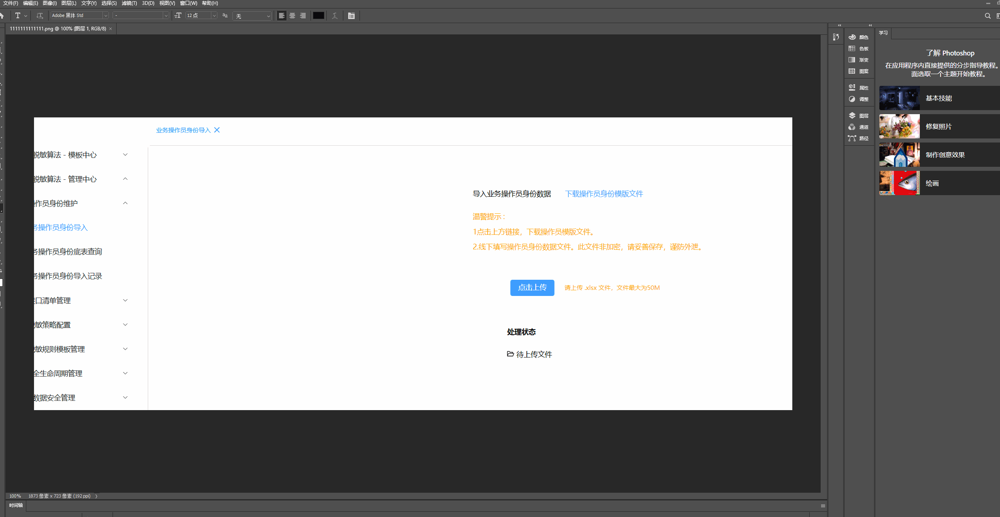
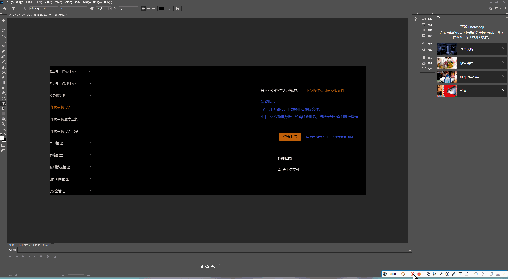

<p align="center">
  <a target="_blank" href="https://github.com/Huo-zai-feng-lang-li/vue3-blind-watermark">
  
  </a>
</p>

<p align="center">
  <h3 align="center">vue3-blind-watermark</h3>
  <p align="center" style="font-size:14px">路虽远行则将至，事虽难做则必成！</p>
</p>

[简体中文](./README.md) | English

## vue3-blind-watermark

-The most user-friendly blind watermarking implementation scheme to date

-The function of this plugin is to add an invisible watermark that can automatically adjust colors to fit different backgrounds on the page, while ensuring the continuous existence of the watermark (tamper proof) by observing DOM changes.

### install

```js
npm install vue3-blind-watermark
```

### Introduction&Use

- In your main application entry file (such as main. js), import and use the watermark:

```js
import watermark from "vue3-blind-watermark";
app
	.use(watermark, {
		text: "版权归xxx所有",
	})
	.mount("#app");
```

### Blind watermark testing

<p align="center">
  <a target="_blank" href="https://github.com/Huo-zai-feng-lang-li/vue3-blind-watermark">
  
  </a>
</p>

<p align="center">
  <a target="_blank" href="https://github.com/Huo-zai-feng-lang-li/vue3-blind-watermark">
  
  </a>
</p>

<p align="center">
  <a target="_blank" href="https://github.com/Huo-zai-feng-lang-li/vue3-blind-watermark">
  
  </a>
</p>

### contributor

> If you have any suggestions for improvement or would like to contribute code, please feel free to create a pull request or submit a question at any time.
